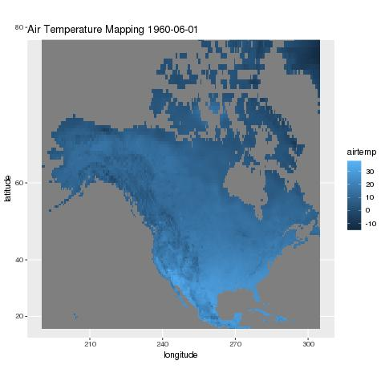
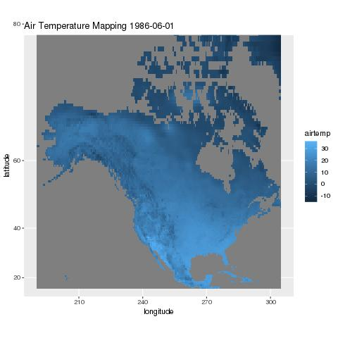
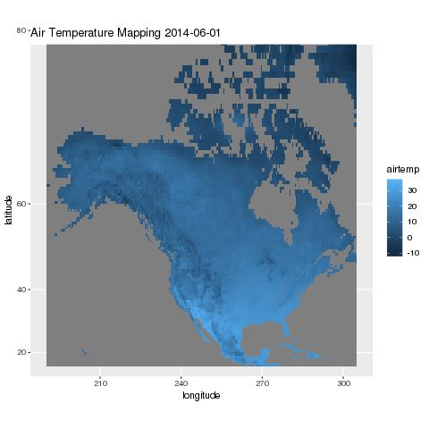
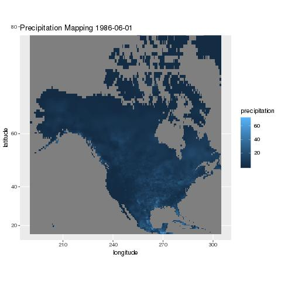
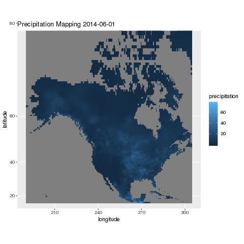

### Data

Below are maps depicting air temperature and precipitation levels across North America in June of 1960, 1987, and 2014.

### Temperature

There doesn't appear to be any major differences between the displays. One might expect 2014 to be much hotter on average, but it appears that this year was actually cooler than the previous ones. It is likely that we are working with a scale that is too large to properly show the more subtle temperature differences across the years. As well, we are only working with three specific years, so any trends that may appear are unreliable.

### Precipitation

While there doesn't appear to a great difference in precipitation patters across the years, there is a noticable upward trend. Specifically, it appears that the central US experienced higher average percipitation in 2014 than in previous years with a larger white area appearing on the 2014 graph than in the others. This is also unreliable for predicting a trend however since these data only represent three years.
